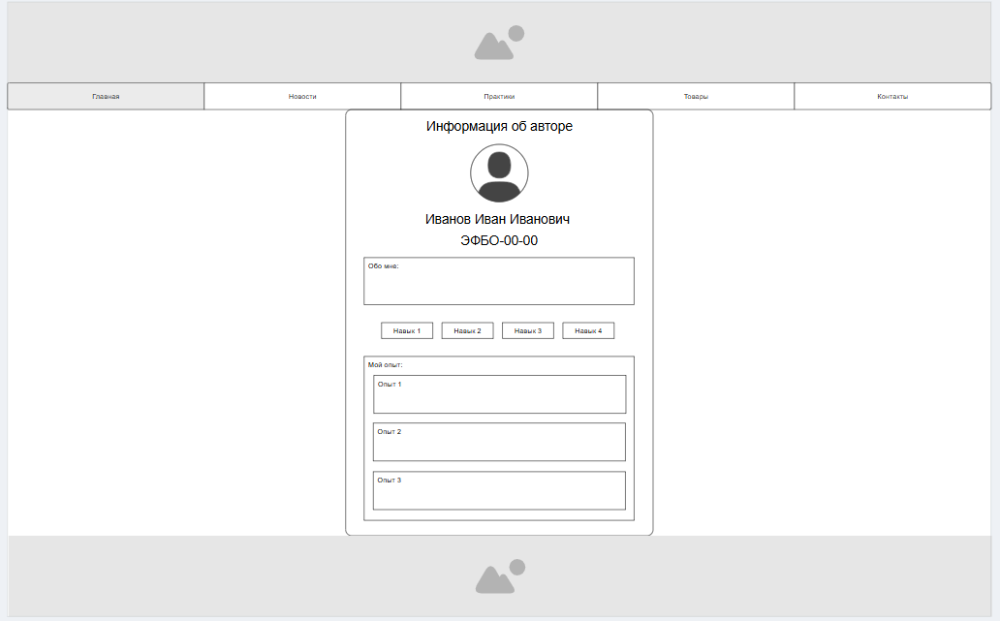

|||
|---|---|
|ДИСЦИПЛИНА|Фронтенд и бэкенд разработка|
|ИНСТИТУТ|ИПТИП|
|КАФЕДРА|Индустриального программирования|
|ВИД УЧЕБНОГО МАТЕРИАЛА|Методические указания к практическим занятиям|
|ПРЕПОДАВАТЕЛЬ|Астафьев Рустам Уралович|
|СЕМЕСТР|1 семестр, 2025/2026 уч. год|

Ссылка на материал: <br>
https://github.com/astafiev-rustam/frontend-and-backend-development/tree/practice-1-7

---

# Практическое занятие 7: Основы языка HTML

---

Об основах языка HTML было рассказно в лекциях по дисциплине. Освежить память можно посредством знакоства с презентациией лекции или ознакомьтесь с материалом по ссылке:<br>
https://htmlacademy.ru/courses/299/

## Базовая структура сайта проекта

Пошагово выполним разработку страниц, которые в дальнейшем будут выступать основной площадкой для работы по практическим занятиям.

### ЭТАП 1. Организация локального и удалённого репозиториев

1. Создайте на компьютере папку ```frontend-and-backend-practice```.<br>

2. Инициализируйте в данной папке пустой репозиторий.
```git
git init
```
3. Создайте в папке файл index.html.<br>

4. В данном файле через редактор кода добавьте текст ```Тестовая страница```.<br>

5. Сделайте коммит и убедитесь в корректности данных.
```git
git add .
git commit -m "Создан файл тестовой страницы Этапа 1"
```
6. Синхронизуйте локальный репозиторий с удалённым или опубликуйте текущий локальный репозиторий.<br>

7. В удалённом репозитории настройте GitHub Pages для отображения стартовой страницы.<br>

8. После корректной загрузки убедитесь в правильном отображении сущности.
<br>
Ссылка:<br>
https://astafiev-rustam.github.io/frontend-and-backend-practice/
---

### ЭТАП 2. Организация и вёрстка главной страницы

Главная страница разрабатываемого проекта представляет собой компонент портфолио с информацией об авторе, ссылками на проекты и дополнительной информацией, которая будет дополняться в процессе работы.

Если представлять базовую вёрстку таких элементов, то за основу можно взять следующий примерный "макет":<br>
<br>

1. В файле ```index.html``` задайте базовые теги ```doctype, html, head, body, title```.
2. В теге заголовка документа продумайте и заполните метаданные и информацию о странице.
3. В теле страницы задайте и разместите последовательно (согласно порядку в макете):
    - блок для хэдера;
    - меню навигации из элементов списка: ```главная, новости, практики, товары, контакты```;
    - блок основной информации, состоящий из:
        - строки "Информация об авторе";
        - фото автора;
        - Фамилия Имя Отчество;
        - Учебная группа;
        - блок текста "Обо мне";
        - четыре блока-элемента с навыками;
        - блок "Мой опыт" с отдельными блоками под каждый опыт работы.
    - блок для футера.

Данная страница будет являться основной при работе над практиками в текущем семестре и будет располагаться в постоянном доступе по ссылке в GitHub Pages. Остальные страницы будут модернизироваться и дополняться в процессе работы над проектами. Все данные на странице, кроме ФИО и группы могут быть ненастоящими.

### ЭТАП 3. Самостоятельная работа

В рамках данной работы необходимо продолжить разработку примера, добавив остальные ключевые страницы проекта. Данные на странице можете заполнять, как в соответствие с реальностью, так и нет.

**ВАЖНО** На текущем этапе не следует использовать продвинутые средства вёрсткии, CSS и/или дополнительные фреймворки в случае, если Вы не уверены в правильности их применения.

1. Создайте файл ```news.html``` - файл для страницы блога новостей и/или новостного форума, в котором должны содержаться следующие элементы:
    - блок для хэдера из основной страницы;
    - меню навигации из основной страницы;
    - блок основной информации, состоящий из блоков (реализовать минимум 3) под каждую новость, каждый из которых содержит:
        - заголовок новости;
        - дата публикации и автор публикации;
        - текст новости;
    - блок для футера из основной страницы.
2. Создайте файл ```goods.html``` - файл для страницы каталога товаров, в котором должны содержаться следующие элементы:
    - блок для хэдера из основной страницы;
    - меню навигации из основной страницы;
    - блок основной информации, состоящий из блоков карточек товаров под каждый товар, каждый из которых содержит:
        - изображение товара;
        - название товара;
        - цена товара;
    - блок для футера из основной страницы.

3. Создайте файл ```contacts.html``` - файл контактов, в котором должны содержаться следующие элементы:
    - блок для хэдера из основной страницы;
    - меню навигации из основной страницы;
    - блок основной информации, который содержит:
        - адрес электронной почты;
        - адрес;
        - кнопка ```Позвоните мне```.
    - блок для футера из основной страницы.

### ЭТАП 4. Проверка результата

В результатте выполнения поставленной задачи доступ к проекту становится возможен по ссылке через GitHub Pages. С помощью меню можно перемещаться между страницами сайта, каждая из которых открывается и отображается в соответствие с настройками.

Пример реализации:


Скриншоты примера: