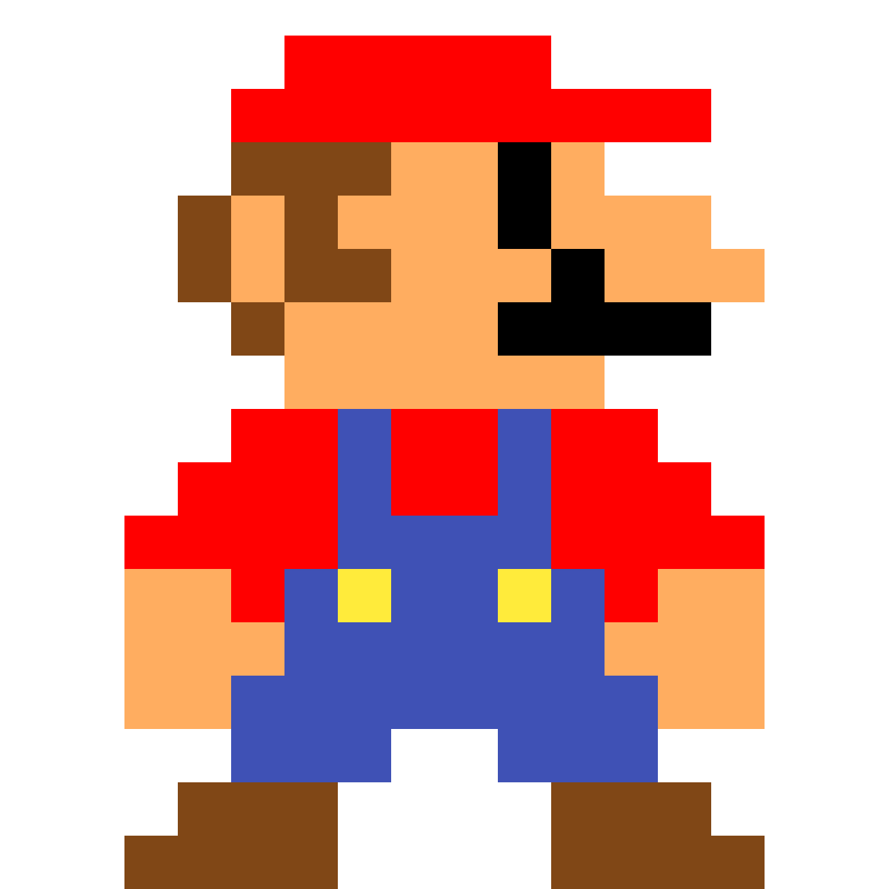
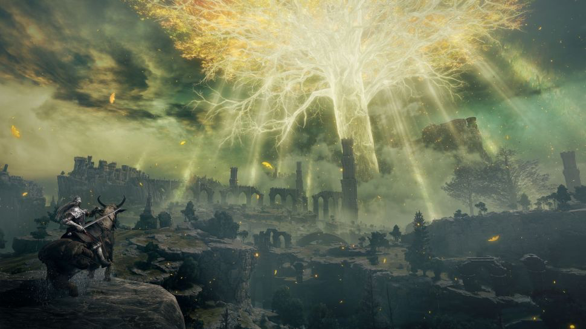
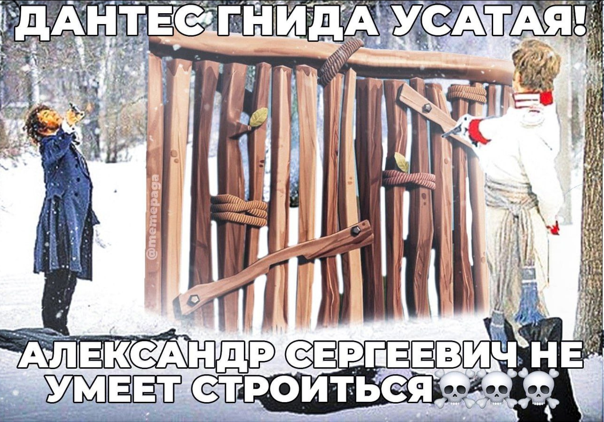
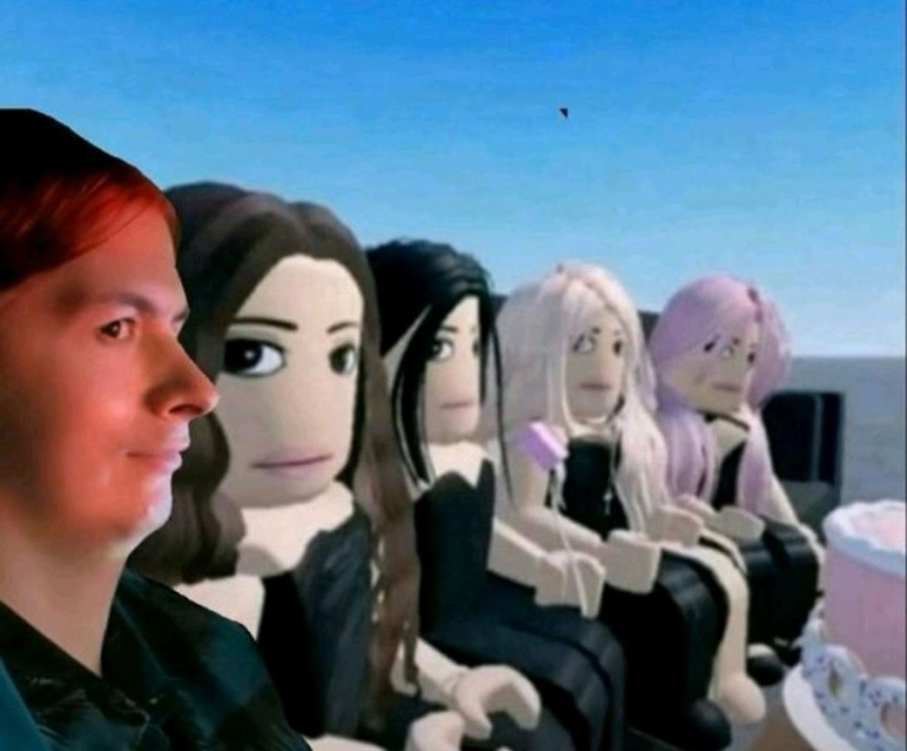
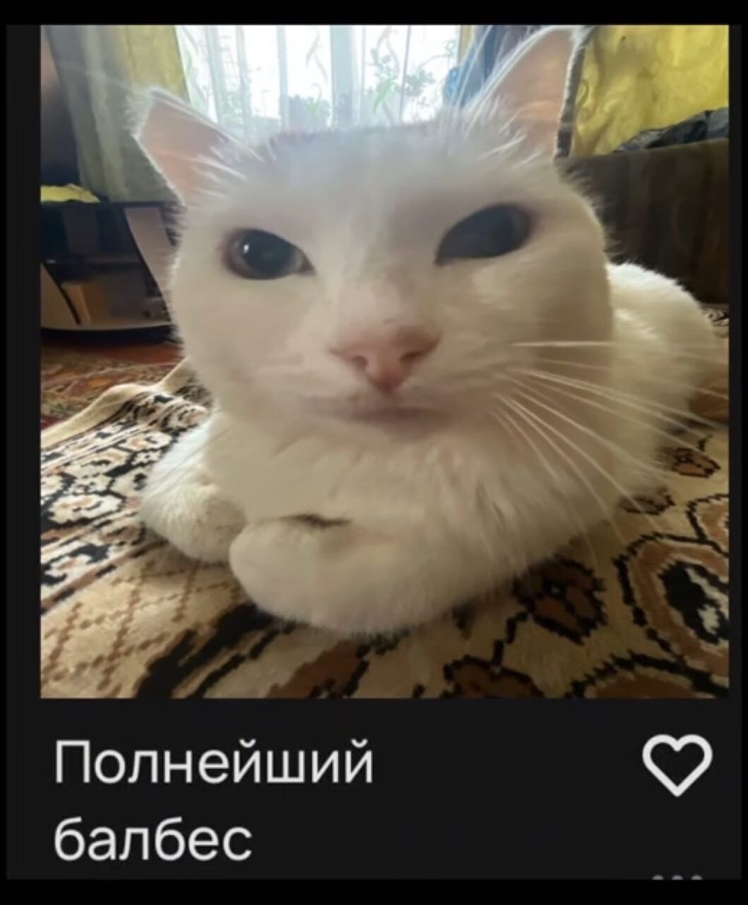

|||
|---|---|
|ДИСЦИПЛИНА|Фронтенд и бэкенд разработка|
|ИНСТИТУТ|ИПТИП|
|КАФЕДРА|Индустриального программирования|
|ВИД УЧЕБНОГО МАТЕРИАЛА|Методические указания к практическим занятиям|
|ПРЕПОДАВАТЕЛЬ|Астафьев Рустам Уралович|
|СЕМЕСТР|1 семестр, 2025/2026 уч. год|

Ссылка на материал: <br>
https://github.com/astafiev-rustam/frontend-and-backend-development/tree/practice-1-16

---

# Практическое занятие 16: Отзывчивое использование изображений. Адаптивность форм, тиблиц и масштабирование элементов

В рамках данного занятия будут использоваться основные подходы к адаптивной вёрстке, о которой речь велась на лекциях.

Для восполнения знаний по данной теме рекомендуется повторить материалы лекции. Дополнительно можно ознакомиться с материалом по ссылке:
https://habr.com/ru/articles/572368/

## Примеры
Выполним примеры и рассмотрим пошаговую подготовку примера с разными способами адаптивности изображений и ресурсов.

### Шаг 1: Подготовка файловой структуры
```
project/
├── index.html
├── styles.css
└── images/
    ├── landscape.jpg
    ├── portrait.jpg
    ├── portrait.webp
    ├── wide-desktop.jpg
    ├── tablet.jpg
    ├── mobile.jpg
    ├── icon@1x.png
    ├── icon@2x.png
    ├── square.jpg
    ├── gallery1.jpg
    ├── gallery2.jpg
    ├── gallery3.jpg
    └── gallery4.jpg
```

### Шаг 2: Создание HTML структуры
1. **Базовая разметка** - создаем контейнер, шапку, основные секции и подвал
2. **Семантические теги** - используем header, main, section, footer для доступности
3. **Секции по техникам** - каждая секция демонстрирует отдельную технику адаптивности

### Шаг 3: Реализация техник адаптивности

#### Техника 1: Базовое адаптивное изображение
```css
.responsive-image {
    width: 100%;      /* Занимает всю ширину контейнера */
    height: auto;     /* Высота рассчитывается автоматически */
    display: block;   /* Убирает лишние отступы */
}
```
**Что происходит:** Изображение масштабируется пропорционально ширине родительского контейнера.

#### Техника 2: Picture element с форматами
```html
<picture>
    <source srcset="images/portrait.webp" type="image/webp">
    <source srcset="images/portrait.jpg" type="image/jpeg">
    
</picture>
```
**Что происходит:** Браузер выбирает WebP если поддерживает, иначе JPEG.

#### Техника 3: Разные изображения для разных экранов
```html
<picture>
    <source media="(min-width: 1200px)" srcset="images/wide-desktop.jpg">
    <source media="(min-width: 768px)" srcset="images/tablet.jpg">
    
</picture>
```
**Что происходит:** Загрузка оптимизированных версий изображений для разных устройств.

#### Техника 4: Retina display поддержка
```html

```
**Что происходит:** На Retina-экранах автоматически загружается @2x версия.

#### Техника 5: Object-fit свойства
```css
.object-fit-cover { object-fit: cover; }    /* Заполняет с обрезкой */
.object-fit-contain { object-fit: contain; } /* Вписывает полностью */
.object-fit-fill { object-fit: fill; }      /* Растягивает */
```
**Что происходит:** Контроль заполнения контейнера изображением.

#### Техника 6: Адаптивная галерея
```css
.gallery {
    display: grid;
    grid-template-columns: repeat(4, 1fr); /* 4 колонки на десктопе */
}

@media (max-width: 768px) {
    .gallery {
        grid-template-columns: repeat(2, 1fr); /* 2 колонки на планшете */
    }
}

@media (max-width: 480px) {
    .gallery {
        grid-template-columns: 1fr; /* 1 колонка на мобильном */
    }
}
```
**Что происходит:** Автоматическое перестроение сетки при изменении размера экрана.

### Шаг 4: Тестирование адаптивности

1. **Изменение размера окна** - плавно меняйте ширину браузера
2. **DevTools Device Mode** - тестируйте на разных устройствах
3. **Проверка Retina** - на MacBook Pro или других Retina-устройствах
4. **Сеть в DevTools** - смотрите какие изображения загружаются

### Шаг 5: Оптимизации

1. **Сжатие изображений** - используйте Squoosh.app или ImageOptim
2. **Правильные форматы** - WebP для фото, PNG для графики
3. **Оптимальные размеры** - готовьте изображения под распространенные breakpoints
4. **Lazy loading** - добавьте `loading="lazy"` для изображений ниже fold

### 1. index.html
```html
<!DOCTYPE html>
<html lang="ru">
<head>
    <meta charset="UTF-8">
    <meta name="viewport" content="width=device-width, initial-scale=1.0">
    <title>Адаптивные изображения - Демо</title>
    <link rel="stylesheet" href="styles.css">
</head>
<body>
    <div class="container">
        <header class="header">
            <h1 class="header__title">Адаптивные изображения</h1>
            <p class="header__subtitle">Демонстрация современных техник</p>
        </header>

        <main class="main">
            <!-- Секция 1: Простое адаптивное изображение -->
            <section class="section">
                <h2 class="section__title">1. Базовое адаптивное изображение</h2>
                <div class="image-container">
                    
                </div>
                <div class="explanation">
                    <h3>Что происходит:</h3>
                    <ul>
                        <li>Изображение занимает 100% ширины контейнера</li>
                        <li>Высота автоматически рассчитывается для сохранения пропорций</li>
                        <li>Работает на всех устройствах</li>
                    </ul>
                </div>
            </section>

            <!-- Секция 2: Picture element с разными версиями -->
            <section class="section">
                <h2 class="section__title">2. Picture element с форматами</h2>
                <div class="image-container">
                    <picture>
                        <!-- WebP для современных браузеров -->
                        <source srcset="images/portrait.webp" type="image/webp">
                        <!-- JPEG для старых браузеров -->
                        <source srcset="images/portrait.jpg" type="image/jpeg">
                        <!-- Фолбэк -->
                        
                    </picture>
                </div>
                <div class="explanation">
                    <h3>Что происходит:</h3>
                    <ul>
                        <li>Браузер выбирает лучший формат (WebP или JPEG)</li>
                        <li>Автоматическое переключение между форматами</li>
                        <li>Фолбэк для старых браузеров</li>
                    </ul>
                </div>
            </section>

            <!-- Секция 3: Разные изображения для разных размеров экрана -->
            <section class="section">
                <h2 class="section__title">3. Разные изображения для разных экранов</h2>
                <div class="image-container">
                    <picture>
                        <!-- Большое изображение для десктопов -->
                        <source media="(min-width: 1200px)" 
                                srcset="images/wide-desktop.jpg">
                        <!-- Среднее для планшетов -->
                        <source media="(min-width: 768px)" 
                                srcset="images/tablet.jpg">
                        <!-- Маленькое для мобильных -->
                        
                    </picture>
                </div>
                <div class="explanation">
                    <h3>Что происходит:</h3>
                    <ul>
                        <li>Десктопы: wide-desktop.jpg (1200px+)</li>
                        <li>Планшеты: tablet.jpg (768px-1199px)</li>
                        <li>Мобильные: mobile.jpg (до 767px)</li>
                        <li>Браузер сам выбирает подходящее изображение</li>
                    </ul>
                </div>
            </section>

            <!-- Секция 4: Retina display поддержка -->
            <section class="section">
                <h2 class="section__title">4. Поддержка Retina дисплеев</h2>
                <div class="image-container">
                    
                </div>
                <div class="explanation">
                    <h3>Что происходит:</h3>
                    <ul>
                        <li>Обычные экраны: icon@1x.png</li>
                        <li>Retina экраны: icon@2x.png (в 2 раза четче)</li>
                        <li>Автоматическое определение плотности пикселей</li>
                    </ul>
                </div>
            </section>

            <!-- Секция 5: Object-fit демонстрация -->
            <section class="section">
                <h2 class="section__title">5. Object-fit свойства</h2>
                <div class="object-fit-demo">
                    <div class="object-fit-item">
                        
                        <span>object-fit: cover</span>
                    </div>
                    <div class="object-fit-item">
                        
                        <span>object-fit: contain</span>
                    </div>
                    <div class="object-fit-item">
                        
                        <span>object-fit: fill</span>
                    </div>
                </div>
                <div class="explanation">
                    <h3>Что происходит:</h3>
                    <ul>
                        <li><strong>cover</strong> - заполняет контейнер, обрезая края</li>
                        <li><strong>contain</strong> - вписывает полностью, могут быть поля</li>
                        <li><strong>fill</strong> - растягивает, искажая пропорции</li>
                    </ul>
                </div>
            </section>

            <!-- Секция 6: Адаптивная галерея без обрезки -->
            <section class="section">
                <h2 class="section__title">6. Адаптивная галерея (без обрезки)</h2>
                <div class="gallery">
                    <div class="gallery__item">
                        <div class="gallery__image-container">
                            
                        </div>
                    </div>
                    <div class="gallery__item">
                        <div class="gallery__image-container">
                            
                        </div>
                    </div>
                    <div class="gallery__item">
                        <div class="gallery__image-container">
                            
                        </div>
                    </div>
                    <div class="gallery__item">
                        <div class="gallery__image-container">
                            
                        </div>
                    </div>
                </div>
                <div class="explanation">
                    <h3>Что происходит:</h3>
                    <ul>
                        <li><strong>На десктопах:</strong> 4 изображения в ряд, пропорциональное масштабирование</li>
                        <li><strong>На мобильных:</strong> 1 изображение в ряд, полная видимость</li>
                        <li><strong>Особенности:</strong> Никакой обрезки, плавное масштабирование, сохранение пропорций</li>
        </ul>
    </div>
</section>
        </main>

        <footer class="footer">
            <p>Измените размер окна браузера чтобы увидеть адаптивность в действии!</p>
        </footer>
    </div>
</body>
</html>
```

### 2. styles.css
```css
/* Базовые сбросы и переменные */
* {
    margin: 0;
    padding: 0;
    box-sizing: border-box;
}

:root {
    --primary-color: #2563eb;
    --text-color: #1e293b;
    --text-light: #64748b;
    --bg-color: #f8fafc;
    --border-color: #e2e8f0;
    --shadow: 0 4px 6px -1px rgb(0 0 0 / 0.1);
    --radius: 8px;
    --transition: all 0.3s ease;
}

body {
    font-family: 'Segoe UI', system-ui, sans-serif;
    line-height: 1.6;
    color: var(--text-color);
    background-color: var(--bg-color);
    padding: 20px;
}

.container {
    max-width: 1200px;
    margin: 0 auto;
}

/* Шапка */
.header {
    text-align: center;
    margin-bottom: 3rem;
    padding: 2rem;
    background: white;
    border-radius: var(--radius);
    box-shadow: var(--shadow);
}

.header__title {
    font-size: 2.5rem;
    margin-bottom: 0.5rem;
    color: var(--primary-color);
}

.header__subtitle {
    font-size: 1.2rem;
    color: var(--text-light);
}

/* Секции */
.section {
    background: white;
    margin-bottom: 3rem;
    padding: 2rem;
    border-radius: var(--radius);
    box-shadow: var(--shadow);
}

.section__title {
    font-size: 1.8rem;
    margin-bottom: 1.5rem;
    color: var(--primary-color);
    border-bottom: 2px solid var(--border-color);
    padding-bottom: 0.5rem;
}

/* Контейнер для изображений */
.image-container {
    margin-bottom: 1.5rem;
    border: 2px dashed var(--border-color);
    border-radius: var(--radius);
    padding: 1rem;
    background: #f8fafc;
}

/* 1. Базовое адаптивное изображение */
.responsive-image {
    width: 100%;
    height: auto;
    display: block;
    border-radius: var(--radius);
}

/* 2. Picture element - стили такие же как у базового */
picture {
    display: block;
}

/* 3. Разные изображения для разных экранов - уже работает через HTML */

/* 4. Retina изображение */
.retina-image {
    width: 100px;
    height: 100px;
    display: block;
    margin: 0 auto;
}

/* 5. Object-fit демонстрация */
.object-fit-demo {
    display: grid;
    grid-template-columns: repeat(3, 1fr);
    gap: 1rem;
    margin-bottom: 1.5rem;
}

.object-fit-item {
    text-align: center;
}

.object-fit-item img {
    width: 100%;
    height: 200px;
    border: 2px solid var(--border-color);
    border-radius: var(--radius);
    margin-bottom: 0.5rem;
}

.object-fit-cover {
    object-fit: cover;
}

.object-fit-contain {
    object-fit: contain;
    background: #f1f5f9;
}

.object-fit-fill {
    object-fit: fill;
}

/* 6. Адаптивная галерея */
.gallery {
    display: grid;
    grid-template-columns: repeat(4, 1fr);
    gap: 1rem;
    margin-bottom: 1.5rem;
}

.gallery__item {
    overflow: hidden;
    border-radius: var(--radius);
}

.gallery__image {
    width: 100%;
    height: 200px;
    object-fit: cover;
    transition: var(--transition);
}

.gallery__image:hover {
    transform: scale(1.05);
}

/* Блоки с объяснениями */
.explanation {
    background: #f1f5f9;
    padding: 1.5rem;
    border-radius: var(--radius);
    border-left: 4px solid var(--primary-color);
}

.explanation h3 {
    margin-bottom: 1rem;
    color: var(--primary-color);
}

.explanation ul {
    list-style-position: inside;
}

.explanation li {
    margin-bottom: 0.5rem;
    padding-left: 1rem;
}

/* Подвал */
.footer {
    text-align: center;
    padding: 2rem;
    background: white;
    border-radius: var(--radius);
    box-shadow: var(--shadow);
    color: var(--text-light);
}

/* Адаптивность для мобильных устройств */
@media (max-width: 768px) {
    body {
        padding: 10px;
    }
    
    .header__title {
        font-size: 2rem;
    }
    
    .section {
        padding: 1rem;
    }
    
    .object-fit-demo {
        grid-template-columns: 1fr;
        gap: 1rem;
    }
    
    .gallery {
        grid-template-columns: repeat(2, 1fr);
    }
    
    .gallery__image {
        height: 150px;
    }
}

@media (max-width: 480px) {
    .header__title {
        font-size: 1.5rem;
    }
    
    .section__title {
        font-size: 1.3rem;
    }
    
    .gallery {
        grid-template-columns: 1fr;
    }
    
    .object-fit-item img {
        height: 150px;
    }
}

/* Поддержка высоких экранов */
@media (min-height: 800px) and (min-width: 1200px) {
    .gallery__image {
        height: 250px;
    }
}

/* Темная тема */
@media (prefers-color-scheme: dark) {
    :root {
        --text-color: #e2e8f0;
        --bg-color: #0f172a;
        --border-color: #334155;
    }
    
    body {
        background-color: var(--bg-color);
        color: var(--text-color);
    }
    
    .section, .header, .footer {
        background: #1e293b;
    }
    
    .explanation {
        background: #334155;
    }
    
    .object-fit-contain {
        background: #475569;
    }
}

/* Адаптивность для печати */
@media print {
    .section {
        break-inside: avoid;
        box-shadow: none;
        border: 1px solid #ccc;
    }
    
    .gallery {
        grid-template-columns: repeat(2, 1fr);
    }
}
```

## Самостоятельная работа
В рамках самостоятельной работы необходимо реализовать средства адаптивности изображений для страниц проекта (по аналогии с главной страницей).