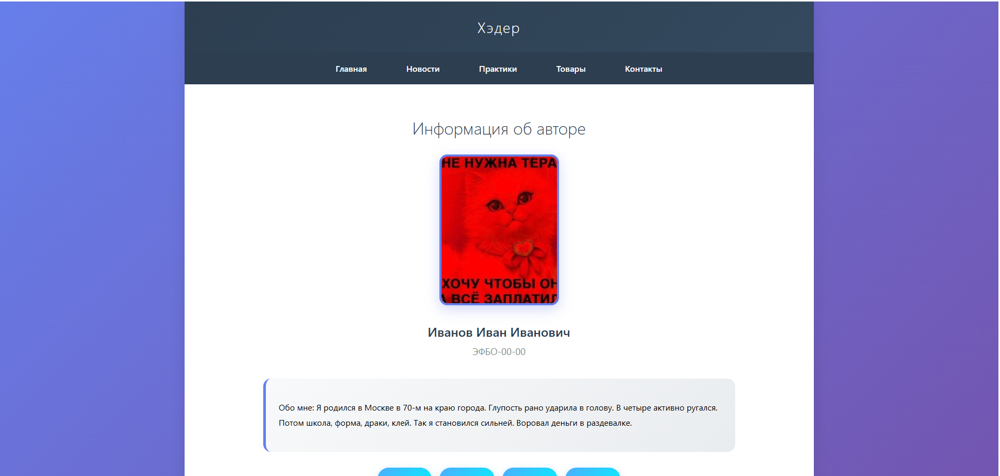
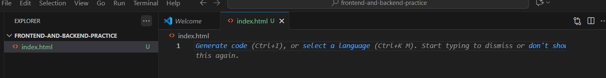
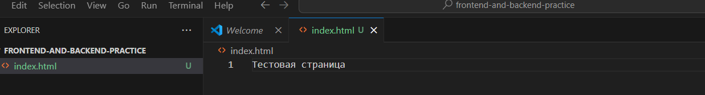
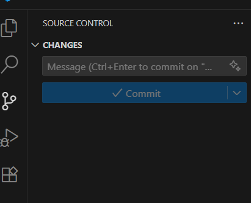
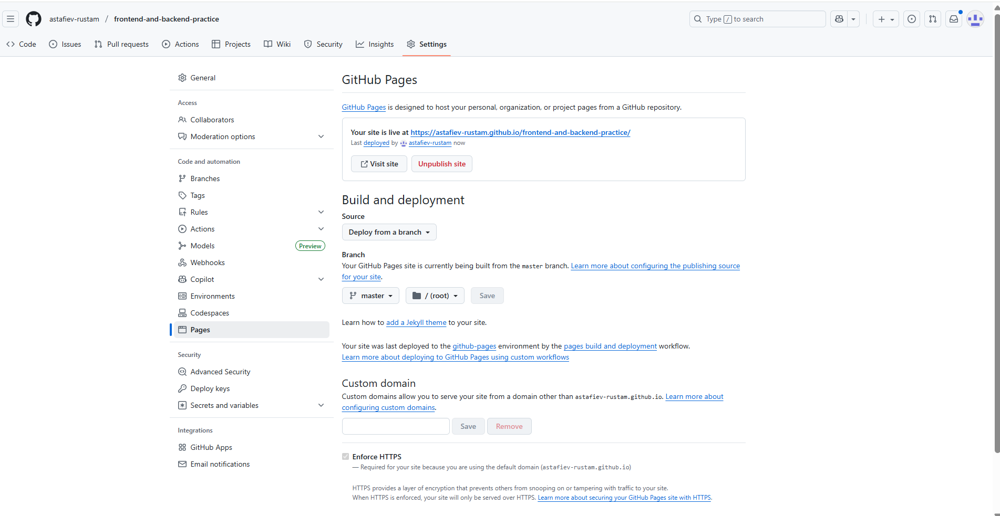
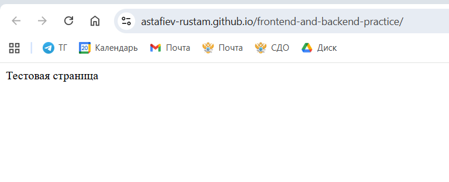

|||
|---|---|
|ДИСЦИПЛИНА|Фронтенд и бэкенд разработка|
|ИНСТИТУТ|ИПТИП|
|КАФЕДРА|Индустриального программирования|
|ВИД УЧЕБНОГО МАТЕРИАЛА|Методические указания к практическим занятиям|
|ПРЕПОДАВАТЕЛЬ|Астафьев Рустам Уралович|
|СЕМЕСТР|1 семестр, 2025/2026 уч. год|

Ссылка на материал: <br>
https://github.com/astafiev-rustam/frontend-and-backend-development/tree/practice-1-7

---

# Практическое занятие 7: Основы языка HTML

---

Об основах языка HTML было рассказно в лекциях по дисциплине. Освежить память можно посредством знакоства с презентациией лекции или ознакомьтесь с материалом по ссылке:<br>
https://htmlacademy.ru/courses/299/

## Базовая структура сайта проекта

Пошагово выполним разработку страниц, которые в дальнейшем будут выступать основной площадкой для работы по практическим занятиям.

### ЭТАП 1. Организация локального и удалённого репозиториев

1. Создайте на компьютере папку ```frontend-and-backend-practice```. 

2. Инициализируйте в данной папке пустой репозиторий.
```git
git init
```
3. Создайте в папке файл index.html.

4. В данном файле через редактор кода добавьте текст ```Тестовая страница```.

5. Сделайте коммит и убедитесь в корректности данных.
```git
git add .
git commit -m "Создан файл тестовой страницы Этапа 1"
```
6. Синхронизуйте локальный репозиторий с удалённым или опубликуйте текущий локальный репозиторий.

7. В удалённом репозитории настройте GitHub Pages для отображения стартовой страницы.

8. После корректной загрузки убедитесь в правильном отображении сущности.

Ссылка:<br>
https://astafiev-rustam.github.io/frontend-and-backend-practice/
---
