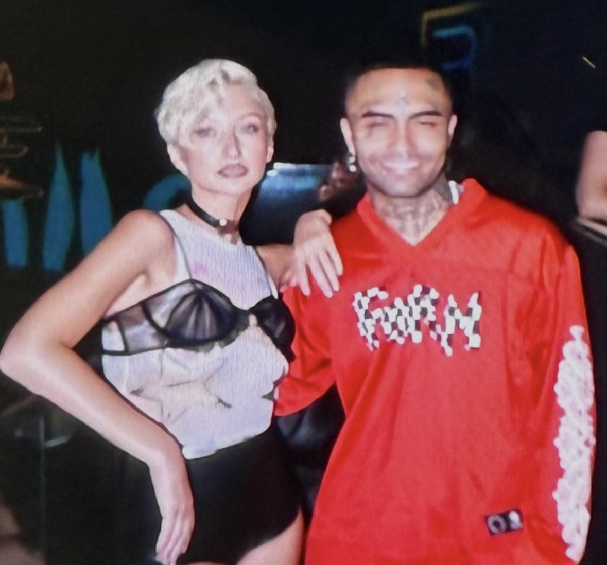

|||
|---|---|
|ДИСЦИПЛИНА|Фронтенд и бэкенд разработка|
|ИНСТИТУТ|ИПТИП|
|КАФЕДРА|Индустриального программирования|
|ВИД УЧЕБНОГО МАТЕРИАЛА|Методические указания к практическим занятиям|
|ПРЕПОДАВАТЕЛЬ|Астафьев Рустам Уралович|
|СЕМЕСТР|1 семестр, 2025/2026 уч. год|

Ссылка на материал: <br>
https://github.com/astafiev-rustam/frontend-and-backend-development/tree/practice-1-18

---

# Практическое занятие 18: Использование Lighthouse и анализ проблем доступности

В рамках данного занятия будут использоваться основные подходы к формированию метрик доступности и использованию Lighthouse.

Для восполнения знаний по данной теме рекомендуется повторить материалы лекции. Дополнительно можно ознакомиться с материалом по ссылке:

https://habr.com/ru/companies/htmlacademy/articles/585866/

## Зачем нужен Lighthouse и метрики доступности?
Lighthouse — это автоматизированный инструмент для проверки качества веб-страниц, который помогает выявлять проблемы с производительностью, доступностью, SEO и другими аспектами. В контексте доступности (A11y) Lighthouse позволяет:
* Обнаруживать распространенные проблемы доступности автоматически
* Получать конкретные рекомендации по исправлению с примерами кода
* Отслеживать прогресс в улучшении доступности проекта
* Выявлять проблемы, которые сложно заметить при ручном тестировании

На этом занятии:
* Научимся использовать Lighthouse для аудита доступности
* Поймем, как интерпретировать результаты и приоритизировать исправления
* Увидим, как автоматизировать процесс проверки доступности

Каждый пример ниже показывает типичные сценарии использования Lighthouse:
1. Исходная страница — пример с проблемами доступности
2. Анализ Lighthouse — какие проблемы выявляет инструмент
3. Исправленный код — готовое доступное решение
4. Что изменилось и почему — детальное объяснение правок

## Примеры
Рассмотрим несколько примеров на обеспечение доступности в веб-приложениях и снятие метрик с использованием Lighthouse

### Пример 1: Анализ базовых проблем доступности

**Рассмотрим пример использования Lighthouse для выявления базовых проблем доступности на простой странице.**

**Исходная страница:**
```html
<!DOCTYPE html>
<html>
<head>
    <title>Мой сайт</title>
    <style>
        .btn { background: blue; color: white; padding: 10px; }
        .text { color: #888; }
        .image { width: 300px; }
    </style>
</head>
<body>
    <div onclick="alert('Clicked!')" class="btn">Нажми меня</div>
    <p class="text">Важная информация</p>
    
    <input type="text" placeholder="Введите имя">
</body>
</html>
```

**Запускаем Lighthouse анализ:**
1. Открываем DevTools (F12)
2. Переходим в вкладку Lighthouse
3. Выбираем "Accessibility"
4. Нажимаем "Generate report"

**Lighthouse покажет следующие проблемы (может варьироваться):**
```
[aria] Элементы с обработчиками клика должны иметь семантическую роль
[color] Контрастность текста недостаточна (2.8:1)
[image] Изображения должны иметь alt атрибуты
[form] Поля ввода должны иметь связанные labels
```

**Вот как интерпретировать и исправить эти проблемы:**

1. Элементы с обработчиками клика

```html
<!-- БЫЛО -->
<div onclick="alert('Clicked!')" class="btn">Нажим меня</div>
<!-- 
  Lighthouse: [aria] Элементы с обработчиками клика должны иметь семантическую роль
  Проблема: div не семантичен для интерактивных действий
-->

<!-- СТАЛО -->
<button class="btn" onclick="alert('Clicked!')">Нажим меня</button>
<!--
  <button> - семантический элемент для действий
  Доступен с клавиатуры (Tab, Enter, Space)
  Правильно объявляется скринридерами
-->
```
2. Контрастность текста

```css
/* БЫЛО */
.text { color: #888; }
/*
Lighthouse: [color] Контрастность текста недостаточна (2.8:1)
Проблема: текст плохо читается для пользователей с ослабленным зрением
*/

/* СТАЛО */
.text { color: #333; }
/*
#333 на белом фоне дает контрастность ~12:1
Соответствует WCAG AA (минимум 4.5:1)
*/
```
3. Изображения без альтернативного текста

```html
<!-- БЫЛО -->

<!-- 
  Lighthouse: [image] Изображения должны иметь alt атрибуты
  Проблема: скринридеры не могут описать изображение
-->

<!-- СТАЛО -->

<!--
  alt-текст описывает содержание изображения
  Помогает незрячим пользователям понять контекст
-->
```
4. Поля ввода без меток

```html
<!-- БЫЛО -->
<input type="text" placeholder="Введите имя">
<!-- 
  Lighthouse: [form] Поля ввода должны иметь связанные labels
  Проблема: непонятно назначение поля для скринридеров
-->

<!-- СТАЛО -->
<label for="username">Имя пользователя</label>
<input type="text" id="username" name="username">
<!--
  label связан с input через for/id
  Скринридер зачитает "Имя пользователя, редактирование текста"
  Увеличивает область клика для мобильных пользователей
-->
```
**Полный код изменений:**

```html
<!DOCTYPE html>
<html lang="ru">
<head>
    <title>Мой сайт - Главная страница</title>
    <style>
        .btn { 
            background: #0056b3; /* Увеличили контраст */
            color: white; 
            padding: 10px;
            border: none;
            cursor: pointer;
        }
        .text { 
            color: #333; /* Увеличили контраст с #888 до #333 */
        }
        .image { width: 300px; }
    </style>
</head>
<body>
    <!-- Было: div с onclick -> Стало: семантическая кнопка -->
    <button class="btn" onclick="alert('Clicked!')">Нажми меня</button>
    
    <p class="text">Важная информация</p>
    
    <!-- Было: img без alt -> Стало: с описательным alt -->
    
    
    <!-- Было: input с placeholder -> Стало: с label -->
    <label for="username">Имя пользователя</label>
    <input type="text" id="username" name="username">
</body>
</html>
```

Таким образом, Lighthouse помог нам выявить критические проблемы доступности, которые мы успешно исправили, сделав страницу более доступной для всех пользователей.

---

### Пример 2: Анализ сложной формы с помощью Lighthouse

**Рассмотрим пример глубокого анализа формы обратной связи с помощью Lighthouse.**

**Исходная страница с формой:**
```html
<!DOCTYPE html>
<html>
<head>
    <title>Контакты</title>
    <style>
        .form-group { margin: 10px 0; }
        .required { color: red; }
        .error { color: red; font-size: 12px; }
    </style>
</head>
<body>
    <h1>Свяжитесь с нами</h1>
    
    <form>
        <div class="form-group">
            <span class="required">*</span>
            <span>Имя:</span>
            <input type="text" name="name">
            <div class="error" id="name-error">Поле обязательно</div>
        </div>
        
        <div class="form-group">
            <span>Email:</span>
            <input type="email" name="email">
        </div>
        
        <div class="form-group">
            <span>Тема:</span>
            <select name="topic">
                <option>Вопрос</option>
                <option>Жалоба</option>
                <option>Предложение</option>
            </select>
        </div>
        
        <div class="form-group">
            <span>Сообщение:</span>
            <textarea name="message"></textarea>
        </div>
        
        <input type="submit" value="Отправить">
    </form>
</body>
</html>
```

**Запускаем расширенный анализ Lighthouse:**
1. В Lighthouse выбираем "Desktop"
2. Ставим галочку "Accessibility" 
3. Запускаем анализ
4. Изучаем детальный отчет

**Lighthouse выявит следующие проблемы (может варьироваться):**
```
[label] Элементы формы должны иметь связанные labels
[aria] Обязательные поля должны иметь aria-required
[aria] Сообщения об ошибках должны быть связаны с полями
[heading] Страница должна иметь один заголовок h1
[select] Выпадающие списки должны иметь понятные options
```

**Вот комплексное исправление на основе отчета Lighthouse:**

1. Обязательные поля

```html
<!-- БЫЛО -->
<div class="form-group">
    <span class="required">*</span>
    <span>Имя:</span>
    <input type="text" name="name">
</div>
<!-- 
  Lighthouse: [aria] Обязательные поля должны иметь aria-required
  Проблема: визуальный индикатор "*" не доступен для скринридеров
-->

<!-- СТАЛО -->
<div class="form-group">
    <label for="name">
        Имя <span class="required" aria-hidden="true">*</span>
    </label>
    <input type="text" id="name" name="name" required aria-required="true">
</div>
<!--
  required - HTML5 атрибут для валидации
  aria-required="true" - сообщает скринридеру об обязательности
  aria-hidden="true" - скрывает "*" от скринридера (дублирует информацию)
-->
```
2. Сообщения об ошибках

```html
<!-- БЫЛО -->
<input type="text" name="name">
<div class="error" id="name-error">Поле обязательно</div>
<!-- 
  Lighthouse: [aria] Сообщения об ошибках должны быть связаны с полями
  Проблема: скринридер не связывает ошибку с полем ввода
-->

<!-- СТАЛО -->
<input type="text" id="name" name="name"
aria-describedby="name-error" aria-invalid="true">
<div id="name-error" class="error" role="alert">
    Поле обязательно для заполнения
</div>
<!--
  aria-describedby - связывает поле с сообщением об ошибке
  aria-invalid="true" - указывает на невалидное состояние
  role="alert" - автоматически объявляет новое сообщение об ошибке
-->
```
3. Выпадающие списки

```html
<!-- БЫЛО -->
<select name="topic">
    <option>Вопрос</option>
    <option>Жалоба</option>
    <option>Предложение</option>
</select>
<!-- 
  Lighthouse: [select] Выпадающие списки должны иметь понятные options
  Проблема: значения не имеют смысла вне контекста
-->

<!-- СТАЛО -->
<select id="topic" name="topic">
    <option value="question">Общий вопрос</option>
    <option value="complaint">Жалоба на обслуживание</option>
    <option value="suggestion">Предложение по улучшению</option>
</select>
<!--
  value содержит машинно-читаемые значения
  Текст option описывает выбор для пользователя
  Скринридер зачитает все доступные варианты
-->
```

**Полный код изменений:**
```html
<!DOCTYPE html>
<html lang="ru">
<head>
    <title>Форма обратной связи - Контакты</title>
    <style>
        .form-group { margin: 15px 0; }
        .required { color: #d63384; }
        .error { 
            color: #d63384; 
            font-size: 14px;
            margin-top: 5px;
        }
        label { display: block; margin-bottom: 5px; font-weight: bold; }
    </style>
</head>
<body>
    <header role="banner">
        <h1>Свяжитесь с нами</h1>
    </header>
    
    <main role="main">
        <form aria-labelledby="form-title">
            <!-- Группа поля имени -->
            <div class="form-group">
                <label for="name">
                    Имя <span class="required" aria-hidden="true">*</span>
                </label>
                <input type="text" 
                       id="name" 
                       name="name"
                       required
                       aria-required="true"
                       aria-describedby="name-error"
                       aria-invalid="true">
                <div id="name-error" class="error" role="alert">
                    Поле обязательно для заполнения
                </div>
            </div>
            
            <!-- Группа поля email -->
            <div class="form-group">
                <label for="email">Email адрес</label>
                <input type="email" 
                       id="email" 
                       name="email"
                       aria-describedby="email-help">
                <div id="email-help" class="help-text">
                    Мы отправим ответ на этот адрес
                </div>
            </div>
            
            <!-- Группа выпадающего списка -->
            <div class="form-group">
                <label for="topic">Тема обращения</label>
                <select id="topic" name="topic">
                    <option value="question">Общий вопрос</option>
                    <option value="complaint">Жалоба на обслуживание</option>
                    <option value="suggestion">Предложение по улучшению</option>
                </select>
            </div>
            
            <!-- Группа текстовой области -->
            <div class="form-group">
                <label for="message">Ваше сообщение</label>
                <textarea id="message" 
                          name="message"
                          aria-describedby="message-help"
                          rows="5"></textarea>
                <div id="message-help" class="help-text">
                    Опишите вашу проблему или вопрос подробно
                </div>
            </div>
            
            <button type="submit" aria-label="Отправить форму обратной связи">
                Отправить сообщение
            </button>
        </form>
    </main>
</body>
</html>
```

Таким образом, Lighthouse не только показал проблемы, но и помог нам создать полностью доступную форму с правильной семантикой, связанными элементами и понятной структурой для скринридеров.

---

### Пример 3: Анализ и оптимизация сложного интерфейса

**Рассмотрим пример анализа сложного интерфейса с модальными окнами и динамическим контентом.**

**Исходная страница с динамическими элементами:**
```html
<!DOCTYPE html>
<html>
<head>
    <title>Интернет-магазин</title>
    <style>
        .modal { display: none; position: fixed; top: 50%; left: 50%; transform: translate(-50%, -50%); background: white; padding: 20px; }
        .overlay { display: none; position: fixed; top: 0; left: 0; width: 100%; height: 100%; background: rgba(0,0,0,0.5); }
        .card { border: 1px solid #ccc; padding: 10px; margin: 10px; }
        .success { color: green; display: none; }
    </style>
</head>
<body>
    <button onclick="openModal()">Добавить в корзину</button>
    
    <div class="overlay" onclick="closeModal()"></div>
    <div class="modal" id="modal">
        <h2>Товар добавлен</h2>
        <p>Товар был успешно добавлен в вашу корзину</p>
        <span onclick="closeModal()">✕</span>
    </div>
    
    <div class="card">
        
        <h3>Новый смартфон</h3>
        <p>Цена: <span style="color: red;">25 000 руб.</span></p>
    </div>
    
    <div class="success" id="success">Успешно!</div>

    <script>
        function openModal() {
            document.getElementById('modal').style.display = 'block';
            document.querySelector('.overlay').style.display = 'block';
            document.getElementById('success').style.display = 'block';
        }
        function closeModal() {
            document.getElementById('modal').style.display = 'none';
            document.querySelector('.overlay').style.display = 'none';
        }
    </script>
</body>
</html>
```

**Запускаем Lighthouse с дополнительными опциями (может варьироваться):**
1. В Lighthouse выбираем "Mobile"
2. Включаем все категории для комплексного анализа
3. Запускаем анализ
4. Анализируем рекомендации по доступности

**Lighthouse выявит сложные проблемы:**
```
[aria] Модальные окна должны иметь правильные ARIA атрибуты
[focus] При открытии модалки фокус должен перемещаться внутрь
[keyboard] Модальные окна должны закрываться по Escape
[color] Информация не должна передаваться только цветом
[image] Карточки товаров должны иметь alt тексты
[aria] Динамические уведомления должны использовать aria-live
```

**Вот как исправить эти сложные проблемы доступности:**

1. Модальные окна

```html
<!-- БЫЛО -->
<div class="modal" id="modal">
    <h2>Товар добавлен</h2>
    <span onclick="closeModal()">×</span>
</div>
<!-- 
  Lighthouse: [aria] Модальные окна должны иметь правильные ARIA атрибуты
  Проблема: скринридер не понимает, что это модальное окно
-->

<!-- СТАЛО -->
<div class="modal" id="modal"
     role="dialog"
     aria-modal="true"
     aria-labelledby="modal-title"
     aria-describedby="modal-desc"
     tabindex="-1">
    <h2 id="modal-title">Товар добавлен в корзину</h2>
    <p id="modal-desc">Смартфон XYZ был успешно добавлен в вашу корзину</p>
</div>
<!--
  role="dialog" - определяет диалоговое окно
  aria-modal="true" - указывает на модальный режим
  aria-labelledby/describedby - связывает с заголовком и описанием
  tabindex="-1" - позволяет программный фокус
-->
```
2. Управление фокусом

```javascript
// БЫЛО
function openModal() {
document.getElementById('modal').style.display = 'block';
// Фокус остается на кнопке открытия
}

// СТАЛО
function openModal() {
const modal = document.getElementById('modal');
modal.style.display = 'block';

    // Запоминаем активный элемент для возврата фокуса
    previousActiveElement = document.activeElement;
    
    // Фокусируемся на модалке
    modal.focus();
    
    // Скрываем основной контент от скринридера
    document.querySelectorAll('main > *').forEach(el => {
        el.setAttribute('aria-hidden', 'true');
    });
}
/*
Lighthouse: [focus] При открытии модалки фокус должен перемещаться внутрь
Решение: захватываем фокус и скрываем фоновый контент
*/
```
3. Закрытие по Escape

```javascript
// НОВЫЙ КОД
function handleEscape(event) {
if (event.key === 'Escape') {
closeModal();
}
}

// Добавляем при открытии модалки
document.addEventListener('keydown', handleEscape);
/*
Lighthouse: [keyboard] Модальные окна должны закрываться по Escape
Решение: добавляем обработчик клавиатуры для закрытия
*/
```
4. Динамические уведомления

```html
<!-- БЫЛО -->
<div class="success" id="success">Успешно!</div>
<!-- 
  Lighthouse: [aria] Динамические уведомления должны использовать aria-live
  Проблема: скринридер не объявляет динамические изменения
-->

<!-- СТАЛО -->
<div class="success" id="success"
     role="status"
     aria-live="polite"
     aria-atomic="true">
    Товар успешно добавлен в корзину!
</div>
<!--
  role="status" - определяет область с обновляемым статусом
  aria-live="polite" - объявляет изменения, не прерывая текущую речь
  aria-atomic="true" - зачитывает всё содержимое при изменении
-->
```
5. Информация только цветом

```html
<!-- БЫЛО -->
<p>Цена: <span style="color: red;">25 000 руб.</span></p>
<!-- 
  Lighthouse: [color] Информация не должна передаваться только цветом
  Проблема: пользователи с дальтонизмом не увидят акценты
-->

<!-- СТАЛО -->
<p>
    Цена: 
    <strong style="color: #dc3545;">25 000 руб.</strong>
    <span class="visually-hidden">Акционная цена</span>
</p>
<!--
  <strong> - семантическое выделение важности
  .visually-hidden - текстовое пояснение для скринридеров
  Сочетание визуальных и текстовых индикаторов
-->
```
**Полный код изменений:**

```html
<!DOCTYPE html>
<html lang="ru">
<head>
    <title>Интернет-магазин - Каталог товаров</title>
    <style>
        .modal { 
            display: none; 
            position: fixed; 
            top: 50%; left: 50%; 
            transform: translate(-50%, -50%); 
            background: white; 
            padding: 30px;
            border-radius: 8px;
            z-index: 1000;
        }
        .overlay { 
            display: none; 
            position: fixed; 
            top: 0; left: 0; 
            width: 100%; height: 100%; 
            background: rgba(0,0,0,0.5); 
            z-index: 999;
        }
        .card { 
            border: 1px solid #ccc; 
            padding: 15px; 
            margin: 15px;
            border-radius: 4px;
        }
        .success { 
            color: #198754; 
            background: #f8f9fa;
            padding: 15px;
            border-radius: 4px;
            display: none;
        }
        /* Стили для фокуса */
        button:focus,
        .close-btn:focus {
            outline: 3px solid #0066cc;
            outline-offset: 2px;
        }
        .visually-hidden {
            position: absolute;
            width: 1px;
            height: 1px;
            padding: 0;
            margin: -1px;
            overflow: hidden;
            clip: rect(0, 0, 0, 0);
            white-space: nowrap;
            border: 0;
        }
    </style>
</head>
<body>
    <header>
        <h1>Каталог товаров</h1>
    </header>

    <main>
        <!-- Карточка товара с доступностью -->
        <article class="card">
            
            <h2>Новый смартфон XYZ</h2>
            <p>
                Цена: 
                <strong style="color: #dc3545;">25 000 руб.</strong>
                <span class="visually-hidden">Акционная цена</span>
            </p>
            
            <!-- Доступная кнопка -->
            <button onclick="openModal()" 
                    aria-label="Добавить смартфон XYZ в корзину покупок">
                Добавить в корзину
            </button>
        </article>
    </main>

    <!-- Доступное модальное окно -->
    <div class="overlay" onclick="closeModal()"></div>
    <div class="modal" 
         id="modal"
         role="dialog"
         aria-modal="true"
         aria-labelledby="modal-title"
         aria-describedby="modal-desc"
         tabindex="-1">
         
        <h2 id="modal-title">Товар добавлен в корзину</h2>
        <p id="modal-desc">Смартфон XYZ был успешно добавлен в вашу корзину покупок</p>
        
        <!-- Доступная кнопка закрытия -->
        <button class="close-btn" 
                onclick="closeModal()"
                aria-label="Закрыть уведомление">
            ✕ <span class="visually-hidden">Закрыть</span>
        </button>
    </div>

    <!-- Динамическое уведомление с aria-live -->
    <div class="success" 
         id="success" 
         role="status"
         aria-live="polite"
         aria-atomic="true">
        Товар успешно добавлен в корзину!
    </div>

    <script>
        let previousActiveElement;

        function openModal() {
            // Запоминаем активный элемент
            previousActiveElement = document.activeElement;
            
            // Показываем модалку
            const modal = document.getElementById('modal');
            modal.style.display = 'block';
            document.querySelector('.overlay').style.display = 'block';
            
            // Показываем уведомление
            document.getElementById('success').style.display = 'block';
            
            // Скрываем основной контент от скринридера
            document.querySelectorAll('main > *').forEach(el => {
                el.setAttribute('aria-hidden', 'true');
            });
            
            // Фокусируемся на модалке
            modal.focus();
            
            // Добавляем обработчик Escape
            document.addEventListener('keydown', handleEscape);
        }

        function closeModal() {
            // Скрываем модалку
            document.getElementById('modal').style.display = 'none';
            document.querySelector('.overlay').style.display = 'none';
            
            // Возвращаем видимость основному контенту
            document.querySelectorAll('[aria-hidden="true"]').forEach(el => {
                el.removeAttribute('aria-hidden');
            });
            
            // Возвращаем фокус
            if (previousActiveElement) {
                previousActiveElement.focus();
            }
            
            // Убираем обработчик
            document.removeEventListener('keydown', handleEscape);
        }

        function handleEscape(event) {
            if (event.key === 'Escape') {
                closeModal();
            }
        }

        // Ловим фокус внутри модалки
        document.getElementById('modal').addEventListener('keydown', function(event) {
            if (event.key === 'Tab') {
                const focusableElements = this.querySelectorAll(
                    'button, [href], input, select, textarea, [tabindex]:not([tabindex="-1"])'
                );
                const firstElement = focusableElements[0];
                const lastElement = focusableElements[focusableElements.length - 1];
                
                if (event.shiftKey && document.activeElement === firstElement) {
                    event.preventDefault();
                    lastElement.focus();
                } else if (!event.shiftKey && document.activeElement === lastElement) {
                    event.preventDefault();
                    firstElement.focus();
                }
            }
        });
    </script>
</body>
</html>
```

Таким образом, Lighthouse помог нам проанализировать сложный интерфейс с динамическими элементами и выявить проблемы, которые не очевидны при поверхностном тестировании. Мы создали полностью доступный интерфейс с правильным управлением фокусом, семантикой модальных окон и доступными динамическими уведомлениями.

После обзора примеров можем перейти к самостоятельной работе.

## Самостоятельная работа
В рамках самостоятельной работы необходимо:
1. Проанализировать доступность с помощью Lighthouse для страницы контактов и устранить все проблемы доступности, отражённые в отчёте.
2. Провести анализ 5 страниц/сервисов в интернете:
   - сохранить отчёт по каждой странице в формате .pdf и подписать "страницаX.pdf", где X - номер страницы;
   - для каждого отчёта просмотреть, какие конкретно элементы вызывают ошибки;
   - продумать варианты изменения в случае комплексных ошибок.

P.S. По последним двум подпунктам задания фиксация выполнения задания не нужна, то есть в качестве ответа размещаете ссылку на репозиторий, где хранятся исходные файлы проекта, а также добавлены 5 отчётов по исследованным страницам.

## Контрольная работа №3

Контрольная работа №3 представляет из себя выполнение набора заданий по практикам 15-18.
Срок выставления оценки по контрольной работе №3 - 13 неделя.