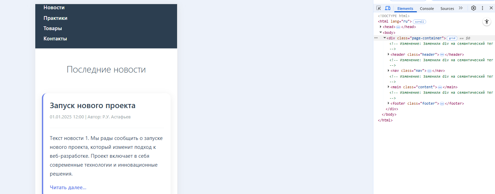
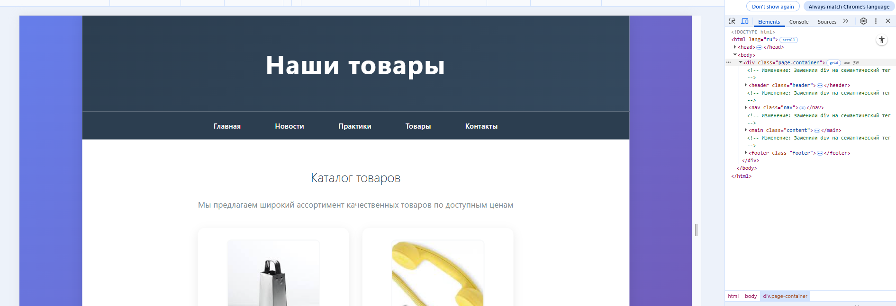

|||
|---|---|
|ДИСЦИПЛИНА|Фронтенд и бэкенд разработка|
|ИНСТИТУТ|ИПТИП|
|КАФЕДРА|Индустриального программирования|
|ВИД УЧЕБНОГО МАТЕРИАЛА|Методические указания к практическим занятиям|
|ПРЕПОДАВАТЕЛЬ|Астафьев Рустам Уралович|
|СЕМЕСТР|1 семестр, 2025/2026 уч. год|

Ссылка на материал: <br>
https://github.com/astafiev-rustam/frontend-and-backend-development/tree/practice-1-9

---

# Практическое занятие 9: Семантические теги, основы навигации. Flex и Grid

---

Об основах позиционирования, использования сеток и семантических тегах было рассказно в лекциях по дисциплине. Освежить память можно посредством знакоства с презентациией лекции или ознакомьтесь с материалом по ссылке:<br>
https://htmlacademy.ru/courses/299/

## Продолжение работы над проектом

Пошагово выполним преобразование семантики проекта и упростим вёрстку страниц с помощью вышеупомянутых инструментов

### ЭТАП 1. Работа над изменениями в файле index.html

Отредактируем содержимое исходный файлов, добавив в страницу index.html семантические теги, а стилевые настройки компонентов наполним вёрсткой на основе flex и grid.

Содержимое index.html:
```html
<!DOCTYPE html>
<html lang="ru">
    <head>
        <meta charset="UTF-8">
        <meta name="viewport" content="width=device-width, initial-scale=1.0">
        <title>Семестровая работа</title>
        <link rel="stylesheet" href="style/styles.css">
    </head>
    <body>
        <!-- Изменение: Заменили div на семантические теги -->
        <div class="page-container">
            <header class="header"> <!-- Было: <div class="header"> -->
                <h1>Хэдер</h1> <!-- Добавили заголовок для семантики -->
            </header>

            <nav class="nav"> <!-- Было: <div class="nav"> -->
                <ul class="nav-list">
                    <li class="nav-item"><a class="nav-link" href="index.html">Главная</a></li>
                    <li class="nav-item"><a class="nav-link" href="pages/news.html">Новости</a></li>
                    <li class="nav-item"><a class="nav-link" href="pages/practices.html">Практики</a></li> 
                    <li class="nav-item"><a class="nav-link" href="pages/goods.html">Товары</a></li>
                    <li class="nav-item"><a class="nav-link" href="pages/contacts.html">Контакты</a></li>
                </ul>
            </nav>

            <main class="content"> <!-- Было: <div class="content"> -->
                <article class="profile-header"> <!-- Было: <div class="profile-header"> -->
                    <h1 class="profile-title">Информация об авторе</h1>
                    
                    <h2 class="profile-name">Иванов Иван Иванович</h2>
                    <p class="profile-group">ЭФБО-00-00</p>
                </article>
                
                <section class="about-me"> <!-- Было: <div class="about-me"> -->
                    <h2>Обо мне</h2> <!-- Добавили заголовок для семантики -->
                    <p>Обо мне: Я родился в Москве в 70-м на краю города. Глупость рано ударила в голову. В четыре активно ругался.
                    Потом школа, форма, драки, клей. Так я становился сильней. Воровал деньги в раздевалке.</p>
                </section>
                
                <section class="skills-container"> <!-- Было: <div class="skills-container"> -->
                    <h2>Мои навыки</h2> <!-- Добавили заголовок для семантики -->
                    <div class="skills-grid"> <!-- Обертка для Grid -->
                        <div class="skill-tag">Навык 1</div>
                        <div class="skill-tag">Навык 2</div>
                        <div class="skill-tag">Навык 3</div>
                        <div class="skill-tag">Навык 4</div>
                    </div>
                </section>
                
                <section class="experience-section"> <!-- Было: <div class="experience-section"> -->
                    <h2 class="section-title">Мой опыт работы</h2>
                    <div class="experience-grid"> <!-- Обертка для Grid -->
                        <article class="experience-card"> <!-- Было: <div class="experience-card"> -->
                            <h3 class="experience-title">Опыт 1</h3>
                            <p class="experience-desc">Работал фантазёром. Сочинял и праздновал.</p>
                        </article>
                        <article class="experience-card">
                            <h3 class="experience-title">Опыт 2</h3>
                            <p class="experience-desc">Работал воровством. Воровал и продавал.</p>
                        </article>
                        <article class="experience-card">
                            <h3 class="experience-title">Опыт 3</h3>
                            <p class="experience-desc">Работал рэпером. Читал и пел.</p>
                        </article>
                    </div>
                </section>
            </main>

            <footer class="footer"> <!-- Было: <div class="footer"> -->
                <p>Футер</p> <!-- Добавили параграф для семантики -->
            </footer>    
        </div>
    </body>
</html>
```

Содержимое styles.css:
```css
/* ===== БАЗОВЫЕ СТИЛИ ===== */
body {
    font-family: 'Segoe UI', Tahoma, Geneva, Verdana, sans-serif;
    margin: 0;
    padding: 0;
    background: linear-gradient(135deg, #667eea 0%, #764ba2 100%);
    min-height: 100vh;
}

/* ===== КОНТЕЙНЕР СТРАНИЦЫ ===== */
/* ИЗМЕНЕНИЕ: Добавили CSS Grid для основного макета страницы */
.page-container {
    max-width: 1200px;
    margin: 0 auto;
    background: white;
    min-height: 100vh;
    box-shadow: 0 0 30px rgba(0,0,0,0.1);
    /* Новое: Сеточный макет для семантических областей */
    display: grid;
    grid-template-rows: auto auto 1fr auto;
    grid-template-areas: 
        "header"
        "nav"
        "main"
        "footer";
}

/* ===== ШАПКА ===== */
.header {
    background: linear-gradient(135deg, #2c3e50 0%, #34495e 100%);
    color: white;
    text-align: center;
    padding: 30px;
    font-size: 28px;
    font-weight: 300;
    letter-spacing: 2px;
    /* Новое: Привязка к области сетки */
    grid-area: header;
}

/* ===== НАВИГАЦИЯ ===== */
.nav {
    background: #2c3e50;
    padding: 20px 0;
    /* Новое: Привязка к области сетки */
    grid-area: nav;
}

.nav-list {
    list-style: none;
    margin: 0;
    padding: 0;
    display: flex;
    justify-content: center;
    gap: 25px;
}

.nav-item {
    margin: 0;
}

.nav-link {
    color: white;
    text-decoration: none;
    padding: 12px 25px;
    border-radius: 25px;
    transition: all 0.3s ease;
    font-weight: 500;
}

.nav-link:hover {
    background: rgba(255,255,255,0.1);
    transform: translateY(-2px);
}

/* ===== ОСНОВНОЙ КОНТЕНТ ===== */
/* ИЗМЕНЕНИЕ: Заменили .content на main для семантики */
main.content {
    padding: 40px;
    max-width: 900px;
    margin: 0 auto;
    /* Новое: Привязка к области сетки */
    grid-area: main;
}

/* ===== ГЛАВНАЯ СТРАНИЦА ===== */
.profile-header {
    text-align: center;
    margin-bottom: 40px;
}

.profile-title {
    font-size: 32px;
    color: #2c3e50;
    margin-bottom: 10px;
    font-weight: 300;
}

.profile-photo {
    width: 220px;
    height: 280px;
    border-radius: 15px;
    object-fit: cover;
    margin: 20px auto;
    border: 4px solid #667eea;
    box-shadow: 0 8px 25px rgba(102, 126, 234, 0.3);
}

.profile-name {
    font-size: 24px;
    color: #2c3e50;
    margin: 10px 0;
    font-weight: 500;
}

.profile-group {
    font-size: 18px;
    color: #7f8c8d;
    margin: 5px 0;
}

.about-me {
    background: linear-gradient(135deg, #f8f9fa 0%, #e9ecef 100%);
    padding: 25px;
    border-radius: 15px;
    margin: 30px 0;
    border-left: 5px solid #667eea;
    font-size: 16px;
    line-height: 1.8;
}

/* ===== НАВЫКИ ===== */
/* ИЗМЕНЕНИЕ: Добавили CSS Grid для навыков */
.skills-grid {
    display: grid;
    grid-template-columns: repeat(auto-fit, minmax(150px, 1fr));
    gap: 15px;
    margin: 20px 0;
}

.skill-tag {
    background: linear-gradient(135deg, #4facfe 0%, #00f2fe 100%);
    color: white;
    padding: 12px 25px;
    border-radius: 25px;
    font-weight: 600;
    font-size: 14px;
    box-shadow: 0 4px 15px rgba(79, 172, 254, 0.3);
    transition: all 0.3s ease;
    text-align: center;
}

.skill-tag:hover {
    transform: translateY(-3px);
    box-shadow: 0 6px 20px rgba(79, 172, 254, 0.4);
}

/* ===== ОПЫТ РАБОТЫ ===== */
.experience-section {
    margin-top: 50px;
}

.section-title {
    font-size: 28px;
    color: #2c3e50;
    text-align: center;
    margin-bottom: 30px;
    font-weight: 300;
}

/* ИЗМЕНЕНИЕ: Добавили CSS Grid для карточек опыта */
.experience-grid {
    display: grid;
    grid-template-columns: repeat(auto-fit, minmax(300px, 1fr));
    gap: 20px;
}

.experience-card {
    background: white;
    padding: 25px;
    border-radius: 12px;
    box-shadow: 0 5px 20px rgba(0,0,0,0.08);
    border-left: 4px solid #667eea;
    transition: transform 0.3s ease;
}

.experience-card:hover {
    transform: translateX(5px);
}

.experience-title {
    font-size: 20px;
    color: #2c3e50;
    margin: 0 0 10px 0;
    font-weight: 600;
}

.experience-desc {
    color: #7f8c8d;
    line-height: 1.6;
    margin: 0;
}

/* ===== НОВОСТИ ===== */
.news-container {
    display: grid;
    gap: 25px;
}

.news-card {
    background: white;
    padding: 30px;
    border-radius: 15px;
    box-shadow: 0 5px 20px rgba(0,0,0,0.08);
    border-left: 4px solid #667eea;
}

.news-title {
    font-size: 24px;
    color: #2c3e50;
    margin: 0 0 10px 0;
    font-weight: 600;
}

.news-meta {
    color: #95a5a6;
    font-size: 14px;
    margin: 0 0 15px 0;
}

.news-text {
    color: #34495e;
    line-height: 1.7;
    margin: 0;
}

/* ===== ТОВАРЫ ===== */
.products-grid {
    display: grid;
    grid-template-columns: repeat(auto-fit, minmax(280px, 1fr));
    gap: 30px;
    margin-top: 30px;
}

.product-card {
    background: white;
    padding: 25px;
    border-radius: 15px;
    text-align: center;
    box-shadow: 0 5px 20px rgba(0,0,0,0.08);
    transition: transform 0.3s ease;
}

.product-card:hover {
    transform: translateY(-5px);
}

.product-image {
    width: 200px;
    height: 250px;
    border-radius: 10px;
    object-fit: cover;
    margin-bottom: 20px;
    border: 3px solid #f8f9fa;
}

.product-name {
    font-size: 18px;
    color: #2c3e50;
    margin: 10px 0;
    font-weight: 600;
}

.product-price {
    font-size: 20px;
    color: #e74c3c;
    font-weight: 700;
    margin: 5px 0;
}

/* ===== КОНТАКТЫ ===== */
.contacts-container {
    text-align: center;
}

.contact-info {
    background: linear-gradient(135deg, #f8f9fa 0%, #e9ecef 100%);
    padding: 25px;
    margin: 20px 0;
    border-radius: 15px;
    font-size: 18px;
    color: #2c3e50;
}

.contact-button {
    background: linear-gradient(135deg, #667eea 0%, #764ba2 100%);
    color: white;
    border: none;
    padding: 15px 40px;
    font-size: 16px;
    border-radius: 30px;
    cursor: pointer;
    margin-top: 20px;
    font-weight: 600;
    transition: all 0.3s ease;
}

.contact-button:hover {
    transform: translateY(-2px);
    box-shadow: 0 8px 25px rgba(102, 126, 234, 0.4);
}

/* ===== ФУТЕР ===== */
.footer {
    background: linear-gradient(135deg, #2c3e50 0%, #34495e 100%);
    color: white;
    text-align: center;
    padding: 30px;
    margin-top: 50px;
    /* Новое: Привязка к области сетки */
    grid-area: footer;
}

/* ===== АДАПТИВНОСТЬ ===== */
/* Новое: Медиа-запросы для мобильных устройств */
@media (max-width: 768px) {
    .nav-list {
        flex-direction: column;
        gap: 10px;
    }
    
    .skills-grid {
        grid-template-columns: 1fr;
    }
    
    .experience-grid {
        grid-template-columns: 1fr;
    }
    
    main.content {
        padding: 20px;
    }
}
```

Полученный вид index.html:


Ссылка:<br>
https://astafiev-rustam.github.io/frontend-and-backend-practice/

---

### ЭТАП 2. Самостоятельная работа

Проведите аналогичные операции для каждой разработанной страницы ```news.html```, ```goods.html```, ```contacts.html``` в соответствие с собственным видением реализации. Обратите внимание, что стилизация элементов и их видение хоть и является индивидуальным, но общие принципы построения интерфейсов в рамках текущей задачи:
- каждый логически и смыслово отличающийся должен отличаться и виузально;
- необходимо соблюдение принципов единства интерфейсов для элементов одинакового назначения.

### ЭТАП 3. Проверка результата

В результате выполнения поставленной задачи доступ к проекту становится возможен по ссылке через GitHub Pages. С помощью меню можно перемещаться между страницами сайта, каждая из которых открывается и отображается в соответствие с настройками.

**Пример реализации:**<br>
https://astafiev-rustam.github.io/frontend-and-backend-practice/

**Скриншоты примера:**<br>




## Базовое задание

В качестве результата по итогам занятия необходимо прикрепить ссылку в соответствующий раздел рабочей области в СДО.